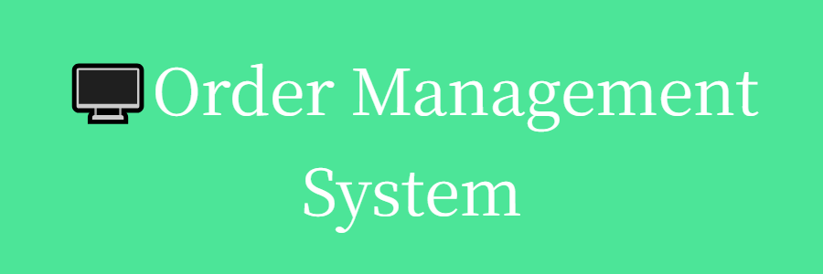

this project is a web application that designed to help restaurants .

## Features

- **user Authentication :** Secure login for employee

- **Menu Management :**
Manage and view menu items

- **Order Management :**
Place orders increase or decrease order quantities

- **Table Management :** Track given orders by table ID

## Used Technologies
- **Backend:** Python, Django
  
- **Frontend:** HTML, CSS, Bootstrap

- **Database:** SQLite 

 
